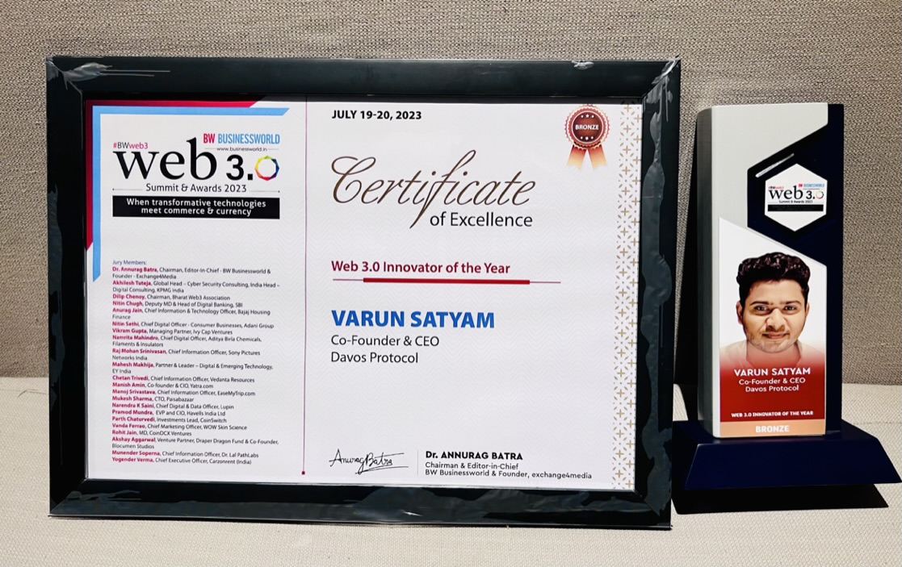
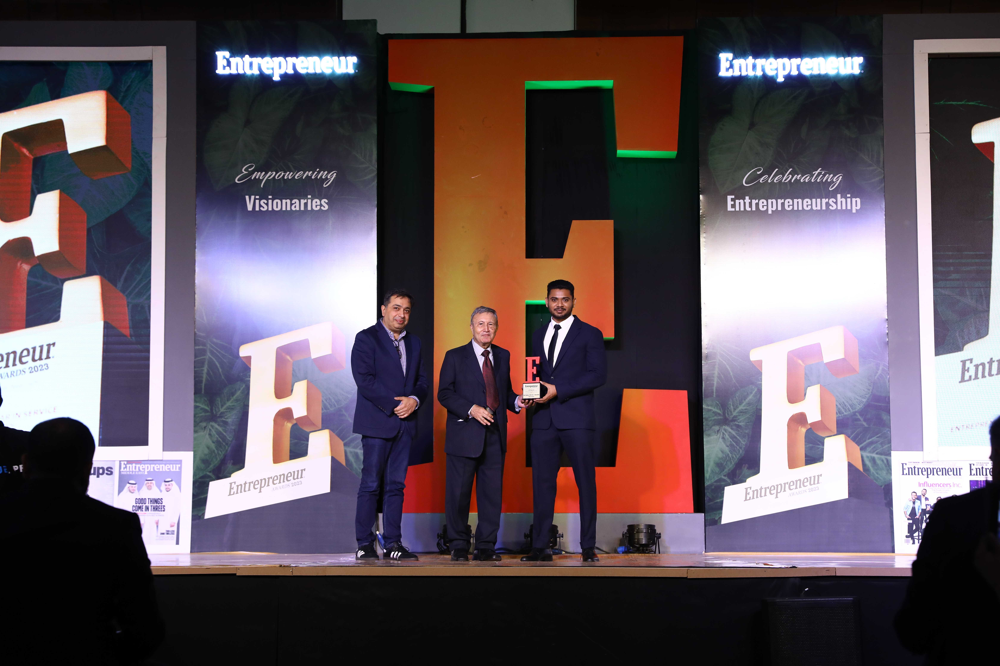

# Hi, I'm Varun Satyam 👋

**Product & design-led founder building at the intersection of crypto and AI.**  
~7 years across Web3 — from protocol UX at Ankr and Bitfinex to founding a DeFi protocol — now building AI-agent tooling at Effortless Labs, Singapore.

---

## What I'm building

I founded [Effortless Labs](https://effortlesslabs.xyz) — a small, opinionated team in Singapore — to build tools that give AI agents lasting, structured memory.

- **[Hyperbola Network](https://hyperbola.network)** — an intelligence and infrastructure layer for AI agents.
- **[Igris](https://igris.bot)** — an AI agent product for real, in-production workflows.
- **LocusGraph** — a typed, temporal, relational knowledge layer for AI agents. Model-agnostic and owner-controlled, so your knowledge graph persists independently of whatever model sits underneath it.

---

## Where I've been

- **Davos Protocol** — Co-Founder & CEO. Built the first native yield-bearing decentralized stablecoin; grew to $1M+ TVL in two months, backed by a $500K pre-seed from Polygon Studios and Sandeep Nailwal.
- **Bitfinex** — UX Designer, working on Lightning Network products (2021).
- **Ankr** — Protocol UX Designer & Project Lead; led UX across 13+ blockchain node integrations (2019–2020).
- Community building with Vizag Startups and Web Summit. BTech, Computer Science — JNTU.

---

## Recognition & Awards

  
  

- 🏆 **Web 3.0 Innovator of the Year (Bronze)** — BW Businessworld Web 3.0 Summit & Awards 2023
- 🏆 **Entrepreneur Awards 2023**
- 🌟 **Entrepreneur Magazine — 35 Under 35**

---

## Let's connect

- 🌐 [varunsatyam.com](https://varunsatyam.com)
- 💼 [LinkedIn](https://linkedin.com/in/exportpng)
- 🛠️ Effortless Labs: [github.com/effortlesslabs](https://github.com/effortlesslabs) · [github.com/hyperbolanetwork](https://github.com/hyperbolanetwork)
